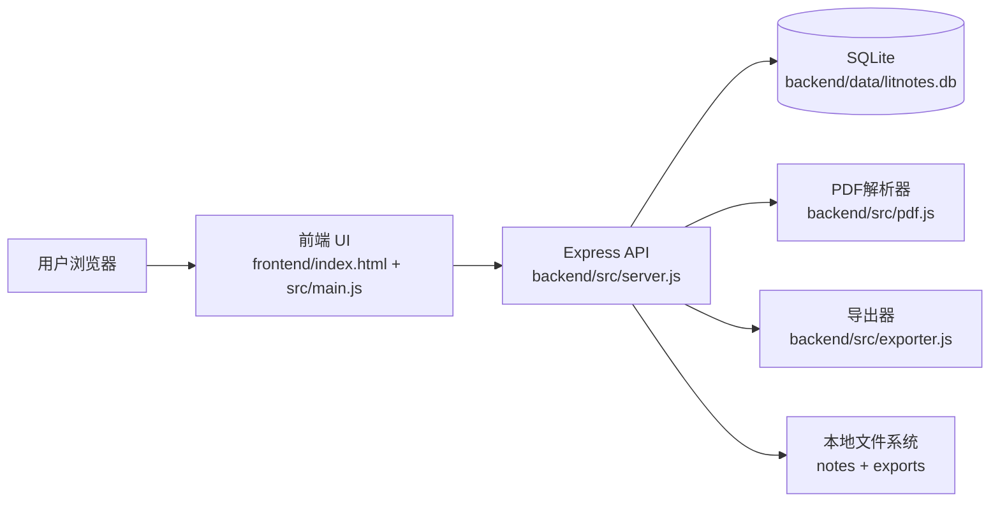
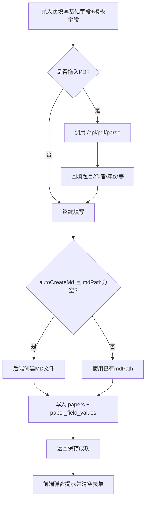
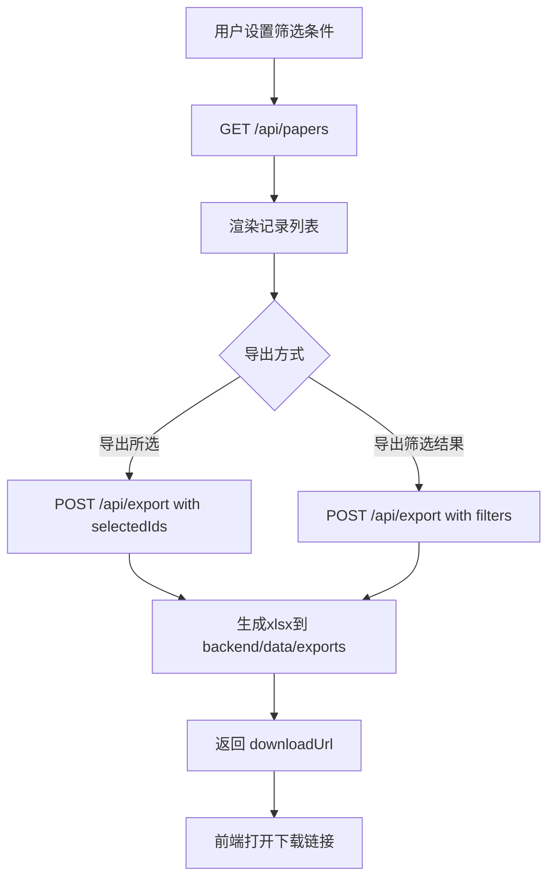
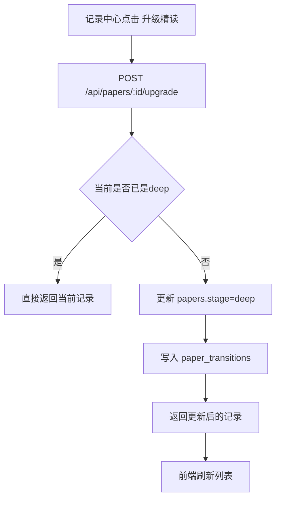
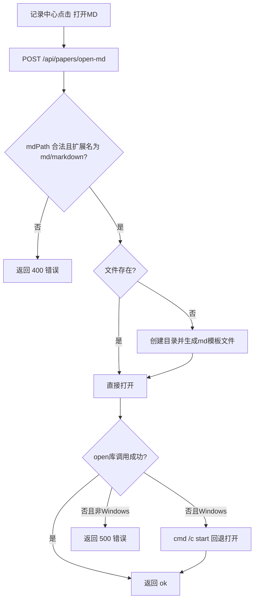
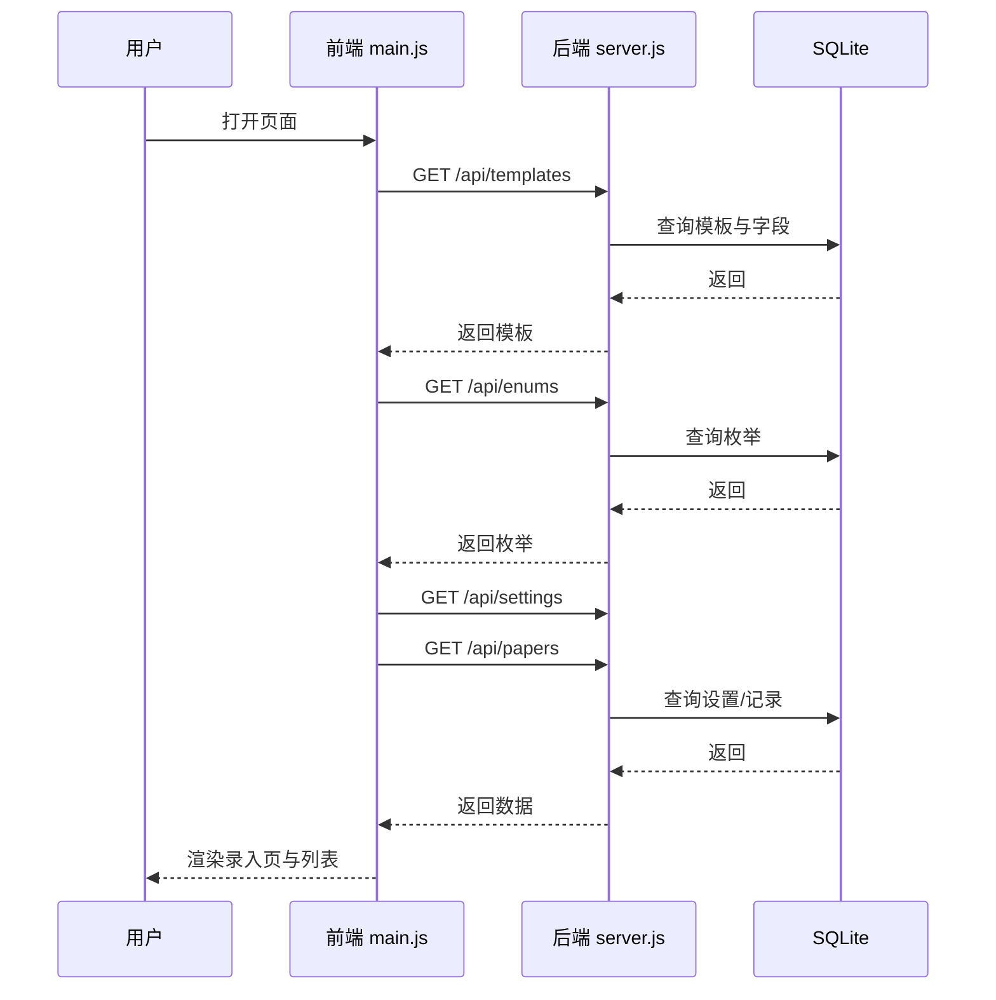

# 系统组件（静态）与业务流程图（动态）说明

## 1. 系统组件（静态视图）

### 1.1 总体组件图（逻辑）

### 1.2 前端组件职责

- 页面骨架：`frontend/index.html`
  - 侧边栏导航（录入页/记录中心/设置）
  - 主内容容器（3 个 panel）
- 主交互：`frontend/src/main.js`
  - 状态管理（模板、枚举、记录、筛选、编辑状态）
  - 页面渲染与事件绑定
  - 录入、筛选、导出、模板管理、枚举管理
- API 客户端：`frontend/src/api/client.js`
  - 所有后端接口封装
- 主题：`frontend/src/theme/index.js`
  - 日夜模式切换与持久化
- 样式：`frontend/src/styles.css`
  - 侧边栏布局、卡片、表格、模态框、响应式规则

### 1.3 后端组件职责

- 应用入口/路由：`backend/src/server.js`
  - 静态资源托管
  - REST API
  - MD 创建/打开、导出下载、PDF 上传解析
- 数据层：`backend/src/db.js`
  - SQLite 初始化与迁移
  - 模板、枚举、设置、文献相关数据库操作
- 常量定义：`backend/src/constants.js`
  - 默认模板字段与默认枚举
- PDF 解析：`backend/src/pdf.js`
  - 标题/作者/年份/DOI 提取
- 导出器：`backend/src/exporter.js`
  - `.xlsx` 生成

### 1.4 数据存储对象（核心表）

- `template_defs`：模板定义（粗读/精读、多套模板）
- `template_fields`：模板字段定义
- `enum_groups` + `enum_options`：下拉枚举
- `papers`：文献主数据（基础字段 + 阶段）
- `paper_field_values`：动态字段值（模板字段值）
- `paper_transitions`：粗读 -> 精读流转日志
- `exports`：导出记录
- `ai_jobs`：AI mock 任务记录
- `app_settings`：系统设置（如 notesDir）

---

## 2. 业务流程图（动态视图）

### 2.1 新建记录（含可选自动创建 MD）

### 2.2 记录中心筛选与导出

### 2.3 粗读升级精读

### 2.4 打开 MD（含缺失文件自动创建）

---

## 3. 关键时序（前后端交互）

### 3.1 页面初始化时序

---

## 4. 非功能边界说明

- 运行形态：本地单机（`127.0.0.1:3000`）。
- PDF 处理：仅本地内存处理，不上传云端。
- MD 打开：依赖操作系统默认应用关联。
- 数据规模：当前按轻量本地使用设计，未做分布式与多租户扩展。